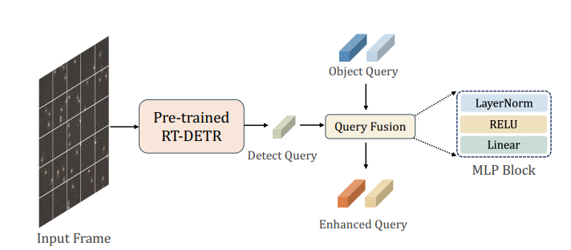
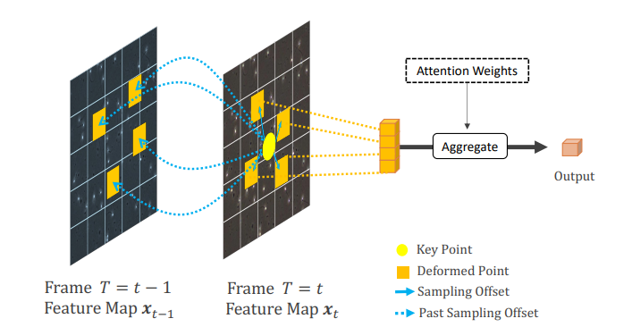

## HDE-Track: Sperm Detection and Tracking Model Using HDE Transformer with Spatio-Temporal Deformable Attention for Sperm Analysis Automation

### Main Method
- Hybrid Detection and Embedding(Left)
- Spatio-Tempotal Deformable Attention Module(Right)

  

## Abstract
Infertility is a common problem, affecting approximately one in six adults worldwide. Several studies have
shown that the male factor is responsible for infertility in up to 50% of couples. Elaborate sperm analysis is
needed to solve this problem. Manual evaluation of sperm motility requires precise microscopic observation.
In addition, the rapid movement of sperm in the microscopic field of view requires a large amount of human
and time labor. To address this issue, the adoption of Computer-Assisted Sperm Analysis (CASA) systems
has been increasing in clinical settings as a replacement for manual evaluations conducted by experts.
To automate sperm analysis, it is necessary to detect and track target sperm from microscopic videos.
However, a baseline has not been established for an end-to-end model that performs sperm detection and
tracking simultaneously. To contribute to the automation of sperm evaluation, we propose HDE-Track, a
model that considers both the detection of blurry sperm and the movement of sperm.
Through experiments conducted using VISEM-Tracking(a human spermatozoa tracking dataset), HDETrack achieved 2.0% improvement in HOTA and 5.2% improvement in MOTA compared to the existing
model TransTrack. The proposed method, HDE-Track, contributes to the automation of sperm analysis by
integrating with conventional CASA systems. HDE-Track can serve as a stronger baseline for future research
on temporal modeling and Transformer-based sperm detection and tracking models.

## Updates
- Update 2025/02/11

## VISEM-Tracking Evaluation

# Base Tracking Model
If download link is invalid, models and logs are also available in [Github Release](https://github.com/PeizeSun/TransTrack/releases/tag/v0.1) and [Baidu Drive](https://pan.baidu.com/s/1dcHuHUZ9y2s7LEmvtVHZZw) by code m4iv.

## Demonstration of Sperm Video Detection & Tracking
  

## Installation
The codebases are built on top of [Deformable DETR](https://github.com/fundamentalvision/Deformable-DETR).

#### Requirements
- Linux, CUDA>=12.4
- Python>=3.10
- PyTorch ≥ 1.5 and [torchvision](https://github.com/pytorch/vision/) that matches the PyTorch installation.
  You can install them together at [pytorch.org](https://pytorch.org) to make sure of this
- OpenCV is optional and needed by demo and visualization

## Citing

The Full paper is currently under review after being submitted to IEEE Access.
https://ieeeaccess.ieee.org/

